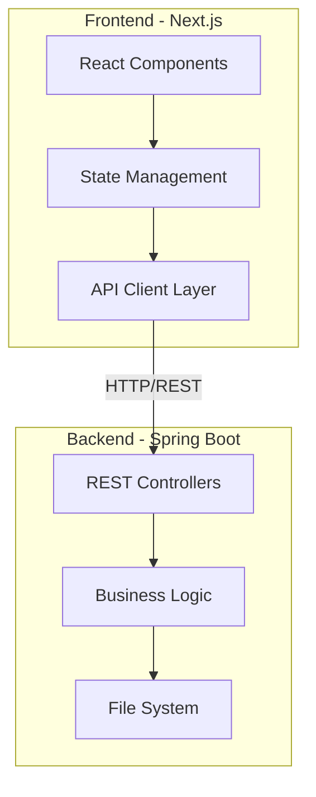

# Design Document: Duplicate Files Web UI

## Overview

The Duplicate Files Web UI is a React Next.js frontend application that provides a visual interface for managing duplicate files. It connects to an existing Spring Boot backend API to retrieve duplicate file analysis results and perform file deletion operations. The application features a two-column layout that clearly separates unique files from their duplicates, enabling users to make informed decisions about which files to keep or delete.

The design emphasizes:
- Clear visual separation between unique and duplicate files
- Intuitive one-to-many relationship visualization
- Efficient bulk operations for managing multiple duplicates
- Responsive design for various screen sizes
- Real-time feedback for all user actions

## Architecture

### High-Level Architecture



### Technology Stack

- **Framework**: Next.js 14+ (App Router)
- **UI Library**: React 18+
- **Language**: TypeScript
- **Styling**: Tailwind CSS
- **HTTP Client**: Fetch API (native)
- **State Management**: React hooks (useState, useReducer)
- **Build Tool**: Next.js built-in (Turbopack/Webpack)

### Architecture Patterns

1. **Component-Based Architecture**: UI is composed of reusable React components
2. **Separation of Concerns**: Clear boundaries between UI, state management, and API communication
3. **Client-Side Rendering**: Initial data fetch on component mount, subsequent updates via API calls
4. **Optimistic UI Updates**: Immediate visual feedback with rollback on failure
5. **Error Boundary Pattern**: Graceful error handling at component boundaries

## Components and Interfaces

### Component Hierarchy

```
App
├── DuplicateFilesPage
│   ├── PageHeader
│   ├── TwoColumnLayout
│   │   ├── UniqueFilesColumn
│   │   │   ├── ColumnHeader
│   │   │   └── FileCard (multiple)
│   │   └── DuplicateFilesColumn
│   │       ├── ColumnHeader
│   │       │   ├── SelectAllCheckbox
│   │       │   └── DeleteSelectedButton
│   │       └── DuplicateGroup (multiple)
│   │           └── FileCard (multiple)
│   ├── LoadingState
│   ├── ErrorState
│   └── NotificationToast
```

### Core Components

#### 1. DuplicateFilesPage
Main page component that orchestrates the entire UI.

**Responsibilities**:
- Fetch duplicate analysis data on mount
- Manage global state (files, selections, loading, errors)
- Handle bulk delete operations
- Coordinate notifications

**State**:
```typescript
interface PageState {
  analysis: DuplicateAnalysis | null;
  selectedFiles: Set<string>; // file paths
  loading: boolean;
  error: string | null;
  notifications: Notification[];
}
```

#### 2. TwoColumnLayout
Responsive layout container for unique and duplicate columns.

**Props**:
```typescript
interface TwoColumnLayoutProps {
  uniqueFiles: FileInfo[];
  duplicateGroups: Map<string, FileInfo[]>;
  selectedFiles: Set<string>;
  onFileSelect: (path: string) => void;
  onFileDelete: (path: string) => Promise<void>;
  onSelectAll: () => void;
  onDeleteSelected: () => Promise<void>;
}
```

#### 3. FileCard
Displays individual file information with actions.

**Props**:
```typescript
interface FileCardProps {
  file: FileInfo;
  isUnique: boolean;
  isSelected?: boolean;
  isDeleting?: boolean;
  onSelect?: (path: string) => void;
  onDelete?: (path: string) => Promise<void>;
  highlightGroup?: string; // hash for relationship highlighting
}
```

**Visual Elements**:
- File name (prominent)
- Full path (secondary text)
- File size (human-readable)
- Modification date (formatted)
- File type category badge
- Checkbox (duplicates only)
- Delete button (duplicates only)
- Loading spinner (during operations)

#### 4. DuplicateGroup
Groups duplicate files that share the same hash.

**Props**:
```typescript
interface DuplicateGroupProps {
  hash: string;
  uniqueFile: FileInfo;
  duplicates: FileInfo[];
  selectedFiles: Set<string>;
  onFileSelect: (path: string) => void;
  onFileDelete: (path: string) => Promise<void>;
  isHighlighted: boolean;
}
```

**Visual Features**:
- Colored border matching unique file
- Group header showing duplicate count
- Visual connection indicator to unique file

#### 5. ColumnHeader
Header for each column with metadata and actions.

**Props**:
```typescript
interface ColumnHeaderProps {
  title: string;
  count: number;
  showSelectAll?: boolean;
  showDeleteSelected?: boolean;
  selectedCount?: number;
  onSelectAll?: () => void;
  onDeleteSelected?: () => Promise<void>;
}
```

### API Client Layer

#### API Service Interface

```typescript
interface DuplicateFilesAPI {
  // Fetch duplicate analysis results
  getAnalysis(): Promise<DuplicateAnalysis>;
  
  // Delete a single file
  deleteFile(path: string): Promise<OperationResult>;
  
  // Delete multiple files
  deleteFiles(paths: string[]): Promise<OperationResult[]>;
}
```

#### API Configuration

```typescript
interface APIConfig {
  baseURL: string; // from environment variable
  timeout: number;
  headers: {
    'Content-Type': 'application/json';
  };
}
```

#### Error Handling

The API client will map HTTP status codes to user-friendly error messages:
- 404: "Resource not found"
- 500: "Server error occurred"
- Network timeout: "Request timed out"
- Connection failure: "Cannot connect to server"

## Data Models

### Frontend TypeScript Interfaces

```typescript
interface FileInfo {
  path: string;
  size: number;
  extension: string;
  modificationDate: string; // ISO 8601 format
  hash: string;
  filename: string;
  filenameWithoutExt: string;
  fileTypeCategory: string;
}

interface DuplicateAnalysis {
  uniqueFiles: FileInfo[];
  duplicateGroups: Record<string, FileInfo[]>; // hash -> duplicates
  totalFiles: number;
  totalUnique: number;
  totalDuplicates: number;
}

interface OperationResult {
  success: boolean;
  sourcePath: string;
  destinationPath: string | null;
  errorMessage: string | null;
}

interface Notification {
  id: string;
  type: 'success' | 'error' | 'info';
  message: string;
  timestamp: number;
}
```

### Data Transformation

The frontend will receive JSON data from the backend and transform it as needed:

1. **Date Parsing**: Convert ISO 8601 strings to Date objects for display formatting
2. **Size Formatting**: Convert bytes to KB/MB/GB for human readability
3. **Hash Mapping**: Create efficient lookup structures for unique file to duplicate group relationships

### State Management Strategy

**Local Component State**: For UI-specific state (hover, focus, temporary values)

**Lifted State**: For shared state managed in DuplicateFilesPage:
- File analysis data
- Selection state
- Loading/error states
- Notifications

**Derived State**: Computed values not stored in state:
- Selected file count
- Filtered/sorted file lists
- Highlight states based on hover


## Correctness Properties

*A property is a characteristic or behavior that should hold true across all valid executions of a system—essentially, a formal statement about what the system should do. Properties serve as the bridge between human-readable specifications and machine-verifiable correctness guarantees.*

### Property 1: Unique files render in left column

*For any* duplicate analysis data containing unique files, all unique files should be rendered in the left column of the layout.

**Validates: Requirements 1.2**

### Property 2: Duplicate files render in right column

*For any* duplicate analysis data containing duplicate files, all duplicate files should be rendered in the right column of the layout.

**Validates: Requirements 1.3**

### Property 3: File cards display complete information

*For any* file (unique or duplicate), the rendered file card should contain the file name, full path, human-readable size, formatted modification date, and file type category.

**Validates: Requirements 1.4, 1.5, 6.1, 6.2, 6.3, 6.4, 6.5**

### Property 4: Visual relationship indicators connect unique files to duplicates

*For any* unique file with associated duplicates, the rendered output should include visual indicators (CSS classes, data attributes, or styling) that connect the unique file to its duplicate group.

**Validates: Requirements 1.6, 10.2**

### Property 5: Column counts match actual data

*For any* duplicate analysis data, the displayed count in the unique files column header should equal the number of unique files, and the displayed count in the duplicate files column header should equal the number of duplicate files.

**Validates: Requirements 2.4, 2.5**

### Property 6: Duplicate files have interactive controls

*For any* duplicate file card, the rendered output should include both a checkbox for selection and a delete button.

**Validates: Requirements 3.1, 4.1**

### Property 7: Delete operation triggers API call with correct path

*For any* duplicate file, clicking the delete button should trigger an API call to the delete endpoint with that file's path as the parameter.

**Validates: Requirements 3.2**

### Property 8: Successful deletion removes file from display

*For any* duplicate file that is successfully deleted (API returns success), that file should no longer appear in the rendered output.

**Validates: Requirements 3.3**

### Property 9: Failed operations display error notifications

*For any* delete operation that fails (API returns error), an error notification should be displayed to the user.

**Validates: Requirements 3.4, 8.3**

### Property 10: Operations in progress show loading state

*For any* file undergoing a delete operation, the file card should display a loading indicator and the delete button should be disabled.

**Validates: Requirements 3.5, 5.5, 8.1**

### Property 11: Checkbox click toggles selection state

*For any* duplicate file, clicking its checkbox should toggle the selection state (selected to unselected, or unselected to selected).

**Validates: Requirements 4.2**

### Property 12: Select all selects every duplicate file

*For any* set of duplicate files, clicking the "Select All" checkbox should set all duplicate files to the selected state.

**Validates: Requirements 4.4**

### Property 13: Select all toggle returns to unselected state

*For any* set of duplicate files, clicking "Select All" twice in succession should result in all files being unselected (idempotence property).

**Validates: Requirements 4.5**

### Property 14: Selection count matches actual selections

*For any* selection state, the displayed count of selected files should equal the actual number of files in the selected state.

**Validates: Requirements 4.6**

### Property 15: Delete selected button visibility depends on selection

*For any* selection state, the "Delete Selected" button should be visible if and only if at least one duplicate file is selected.

**Validates: Requirements 5.1**

### Property 16: Bulk delete triggers API calls for all selected files

*For any* set of selected duplicate files, clicking "Delete Selected" should trigger delete API calls for each selected file path.

**Validates: Requirements 5.2**

### Property 17: Successful bulk delete removes all deleted files

*For any* bulk delete operation where all API calls succeed, all deleted files should be removed from the rendered output.

**Validates: Requirements 5.3**

### Property 18: Bulk delete errors identify failed files

*For any* bulk delete operation with failures, the error notification should identify which specific files failed to delete.

**Validates: Requirements 5.4**

### Property 19: Bulk delete completion clears selections

*For any* bulk delete operation (regardless of success or failure), all selection states should be cleared when the operation completes.

**Validates: Requirements 5.6**

### Property 20: Error messages include retry functionality

*For any* error notification displayed to the user, a retry button should be present to allow re-attempting the failed operation.

**Validates: Requirements 7.5**

### Property 21: Successful operations display success notifications

*For any* delete operation that succeeds, a success notification should be displayed to the user.

**Validates: Requirements 8.2**

### Property 22: Data fetch operations show loading state

*For any* API call to fetch duplicate analysis data, a loading state should be displayed while the request is in progress.

**Validates: Requirements 8.4**

### Property 23: Success notifications auto-dismiss after timeout

*For any* success notification, it should be automatically removed from the display after 3 seconds.

**Validates: Requirements 8.5**

### Property 24: Delete requests use correct HTTP method and payload

*For any* file deletion operation, the API request should use the DELETE HTTP method and include the file path in the request payload.

**Validates: Requirements 9.3**

### Property 25: API requests include required headers

*For any* API request (GET or DELETE), the request should include the Content-Type header set to "application/json".

**Validates: Requirements 9.4**

### Property 26: Duplicate groups maintain file associations

*For any* unique file with associated duplicates, all duplicate files with the same hash should be rendered together as a group in the right column.

**Validates: Requirements 10.1**

### Property 27: Hover interactions trigger bidirectional highlighting

*For any* unique file with duplicates, hovering over the unique file should highlight its duplicate group, and hovering over any duplicate in the group should highlight the corresponding unique file.

**Validates: Requirements 10.3, 10.4**

### Property 28: Duplicate count displays accurate numbers

*For any* unique file with associated duplicates, the displayed duplicate count should equal the actual number of duplicate files in that group.

**Validates: Requirements 10.5**


## Error Handling

### Error Categories

#### 1. Network Errors
**Scenarios**:
- Backend server is unreachable
- Network connection lost
- Request timeout

**Handling Strategy**:
- Display user-friendly error message: "Cannot connect to server. Please check your connection."
- Provide retry button
- Log detailed error to console for debugging
- Maintain current UI state (don't clear existing data)

#### 2. HTTP Error Responses
**Scenarios**:
- 404 Not Found: Resource doesn't exist
- 500 Internal Server Error: Backend failure
- 400 Bad Request: Invalid request format

**Handling Strategy**:
- Map status codes to specific error messages
- Display error notification with appropriate message
- Provide retry button for transient errors (500, 503)
- Log full error response for debugging

#### 3. Operation Failures
**Scenarios**:
- File deletion fails (file locked, permissions, etc.)
- Bulk operation partially fails
- Concurrent modification conflicts

**Handling Strategy**:
- Display specific error message from backend
- For bulk operations, show which files succeeded and which failed
- Maintain UI consistency (remove successfully deleted files)
- Allow retry for failed operations only

#### 4. Client-Side Errors
**Scenarios**:
- Invalid data format from API
- Unexpected null/undefined values
- Component rendering errors

**Handling Strategy**:
- Use React Error Boundaries to catch rendering errors
- Validate API response data before processing
- Provide fallback UI for error states
- Log errors to console with stack traces

### Error Recovery Mechanisms

1. **Retry Logic**: All failed operations can be retried via UI button
2. **Optimistic Updates with Rollback**: UI updates immediately, rolls back on failure
3. **Graceful Degradation**: Show partial data if some operations fail
4. **Error Boundaries**: Prevent entire app crash from component errors

### Error Message Format

```typescript
interface ErrorNotification {
  type: 'error';
  title: string;
  message: string;
  details?: string; // Technical details for debugging
  retryAction?: () => void;
  dismissible: boolean;
}
```

### HTTP Status Code Mapping

```typescript
const ERROR_MESSAGES: Record<number, string> = {
  400: 'Invalid request. Please try again.',
  404: 'Resource not found.',
  500: 'Server error occurred. Please try again later.',
  503: 'Service temporarily unavailable.',
};

const NETWORK_ERROR_MESSAGE = 'Cannot connect to server. Please check your connection.';
const TIMEOUT_ERROR_MESSAGE = 'Request timed out. Please try again.';
```

## Testing Strategy

### Overview

The testing strategy employs a dual approach combining unit tests for specific scenarios and property-based tests for comprehensive coverage of universal behaviors. This ensures both concrete edge cases and general correctness are validated.

### Testing Framework and Tools

- **Unit Testing**: Jest + React Testing Library
- **Property-Based Testing**: fast-check (JavaScript/TypeScript PBT library)
- **Component Testing**: React Testing Library
- **API Mocking**: MSW (Mock Service Worker)
- **Test Runner**: Jest
- **Coverage Tool**: Jest coverage reports

### Unit Testing Approach

Unit tests focus on:
- Specific user interaction examples
- Edge cases (empty data, single file, large datasets)
- Error conditions (network failures, API errors)
- Integration between components
- Responsive layout breakpoints

**Example Unit Tests**:
```typescript
describe('DuplicateFilesPage', () => {
  it('should display connection error when API is unreachable', async () => {
    // Test specific error scenario
  });
  
  it('should render empty state when no duplicates exist', () => {
    // Test edge case
  });
  
  it('should stack columns vertically on mobile viewport', () => {
    // Test responsive behavior at 768px breakpoint
  });
});
```

### Property-Based Testing Approach

Property tests verify universal behaviors across randomly generated inputs. Each property test will:
- Run minimum 100 iterations with randomized data
- Reference the corresponding design document property
- Use fast-check generators for test data

**Property Test Configuration**:
```typescript
import fc from 'fast-check';

// Minimum 100 iterations per property test
const TEST_ITERATIONS = 100;

// Tag format for traceability
// Feature: duplicate-files-web-ui, Property {number}: {property_text}
```

**Example Property Tests**:

```typescript
describe('Property 3: File cards display complete information', () => {
  it('should display all required fields for any file', () => {
    // Feature: duplicate-files-web-ui, Property 3: File cards display complete information
    fc.assert(
      fc.property(
        fc.record({
          path: fc.string(),
          size: fc.nat(),
          extension: fc.string(),
          modificationDate: fc.date().map(d => d.toISOString()),
          hash: fc.hexaString(),
        }),
        (file) => {
          const { getByText } = render(<FileCard file={file} isUnique={false} />);
          // Verify all fields are present in rendered output
          expect(getByText(file.path)).toBeInTheDocument();
          // ... additional assertions
        }
      ),
      { numRuns: TEST_ITERATIONS }
    );
  });
});

describe('Property 11: Checkbox click toggles selection state', () => {
  it('should toggle selection for any duplicate file', () => {
    // Feature: duplicate-files-web-ui, Property 11: Checkbox click toggles selection state
    fc.assert(
      fc.property(
        fc.record({
          path: fc.string(),
          size: fc.nat(),
          extension: fc.string(),
          modificationDate: fc.date().map(d => d.toISOString()),
          hash: fc.hexaString(),
        }),
        fc.boolean(), // initial selection state
        (file, initiallySelected) => {
          const onSelect = jest.fn();
          const { getByRole } = render(
            <FileCard 
              file={file} 
              isUnique={false} 
              isSelected={initiallySelected}
              onSelect={onSelect}
            />
          );
          
          const checkbox = getByRole('checkbox');
          fireEvent.click(checkbox);
          
          expect(onSelect).toHaveBeenCalledWith(file.path);
        }
      ),
      { numRuns: TEST_ITERATIONS }
    );
  });
});
```

### Test Data Generators

Custom fast-check generators for domain-specific data:

```typescript
// Generator for FileInfo objects
const fileInfoArbitrary = fc.record({
  path: fc.string({ minLength: 1 }),
  size: fc.nat(),
  extension: fc.constantFrom('.jpg', '.pdf', '.txt', '.mp4', '.zip'),
  modificationDate: fc.date().map(d => d.toISOString()),
  hash: fc.hexaString({ minLength: 64, maxLength: 64 }),
  filename: fc.string({ minLength: 1 }),
  filenameWithoutExt: fc.string({ minLength: 1 }),
  fileTypeCategory: fc.constantFrom('images', 'documents', 'videos', 'audio', 'archives', 'other'),
});

// Generator for DuplicateAnalysis objects
const duplicateAnalysisArbitrary = fc.record({
  uniqueFiles: fc.array(fileInfoArbitrary, { minLength: 0, maxLength: 50 }),
  duplicateGroups: fc.dictionary(
    fc.hexaString({ minLength: 64, maxLength: 64 }),
    fc.array(fileInfoArbitrary, { minLength: 1, maxLength: 10 })
  ),
  totalFiles: fc.nat(),
  totalUnique: fc.nat(),
  totalDuplicates: fc.nat(),
});
```

### Coverage Goals

- **Line Coverage**: Minimum 80%
- **Branch Coverage**: Minimum 75%
- **Function Coverage**: Minimum 80%
- **Property Test Coverage**: All 28 correctness properties must have corresponding property tests

### Test Organization

```
frontend/
├── __tests__/
│   ├── unit/
│   │   ├── components/
│   │   │   ├── FileCard.test.tsx
│   │   │   ├── DuplicateGroup.test.tsx
│   │   │   └── TwoColumnLayout.test.tsx
│   │   ├── api/
│   │   │   └── duplicateFilesAPI.test.ts
│   │   └── utils/
│   │       └── formatters.test.ts
│   ├── properties/
│   │   ├── fileCardProperties.test.tsx
│   │   ├── selectionProperties.test.tsx
│   │   ├── deleteOperationProperties.test.tsx
│   │   └── visualRelationshipProperties.test.tsx
│   └── integration/
│       └── DuplicateFilesPage.integration.test.tsx
```

### Mocking Strategy

**API Mocking with MSW**:
```typescript
import { rest } from 'msw';
import { setupServer } from 'msw/node';

const server = setupServer(
  rest.get('/api/analysis', (req, res, ctx) => {
    return res(ctx.json(mockAnalysisData));
  }),
  rest.delete('/api/files', (req, res, ctx) => {
    return res(ctx.json({ success: true }));
  })
);

beforeAll(() => server.listen());
afterEach(() => server.resetHandlers());
afterAll(() => server.close());
```

### Continuous Integration

- Run all tests on every commit
- Fail build if coverage drops below thresholds
- Run property tests with increased iterations (1000+) in CI for deeper validation
- Generate and publish coverage reports

### Testing Balance

- **Unit tests**: Focus on specific examples, edge cases, and error conditions
- **Property tests**: Verify universal properties across all inputs
- Avoid writing too many unit tests for behaviors already covered by property tests
- Property tests handle comprehensive input coverage through randomization
- Unit tests validate concrete scenarios and integration points

